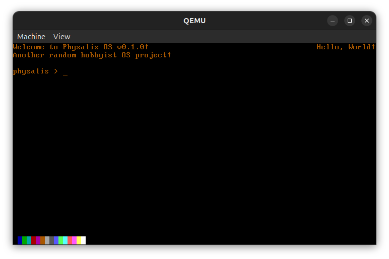

# 💾 Physalis OS

<div align="center">




</div>

> *Another random hobbyist OS project!*

## ❓️ Why and Goals

One day, I watched a video about OS development, and I though this was super neat! I know this is considered to be the hardest project, but it's also very rewarding when something finally work. This is not a serious project, my main goal is just to learn (and to have a cool project too, let's be real), which is why it's the only time you'll ever see comments in my code, shocking I know!


## 🛠️ Features

For now, it includes basic text editing tools (without keyboard support for now): it can display coloured text with a relative or absolute position, delete a character, scroll up when it overflows, and clear the screen. For more details on what I've done and want to implement next, check out [TODO.md](./TODO.md)!

When you emulate or boot on it, you'll first see the GRUB menu, with four options:

- Physalis OS VGA Mode, should boot with VGA mode.
- Physalis OS Text Mode, no idea what this does to be honest.
- Escape, reboots the machine.
- Go touch grass, shutdowns the machine.


## 🪧 Specifications and Technical Details

- 32-bit bootloader coded with Intel x86 Assembly.
- C kernel compiled with an ELF32 architecture.
- GRUB and multiboot2 support.
- Cross compiler created with [GCC](https://ftp.gnu.org/gnu/gcc) 15.2.0 and [Binutils](https://ftp.gnu.org/gnu/binutils) 2.45.


## 🔧 Debian Packages

### 🖥️ Compilation and Emulation

```bash
sudo apt install nasm mtools qemu-utils qemu-system-x86 qemu-system-gui
```


### 🏗️ Cross Compiler

```bash
sudo apt install build-essential bison flex libgmp3-dev libmpc-dev libmpfr-dev texinfo libisl-dev
```


### 📦️ Other Useful Packages

```bash
sudo apt install xxd mtools libcanberra-gtk-module libcanberra-gtk3-module grub-pc-bin
```


## 🧰 Tools

### 🔨 Makefile Commands

```bash
sudo make build_all            # Builds both the ISO and IMG files
make build_img                 # Builds the IMG file
sudo make build_iso            # Builds the ISO file
make clean                     # Deletes binaries and compiled scripts
make compile                   # Compiles the project
make debug                     # Launch the ISO with QEMU in debug mode
make emulate                   # Emulates the ISO file with QEMU
```


### 📜 Bash Scripts

```bash
./scripts/tests.sh             # Displays the result of various tests
sudo ./scripts/compile.sh      # Cleans, compiles, builds, tests and emulates the ISO
sudo ./scripts/debug.sh        # Cleans, compiles, builds, tests and debugs the ISO
sudo ./scripts/production.sh   # Burns the $volume with the ISO file
```